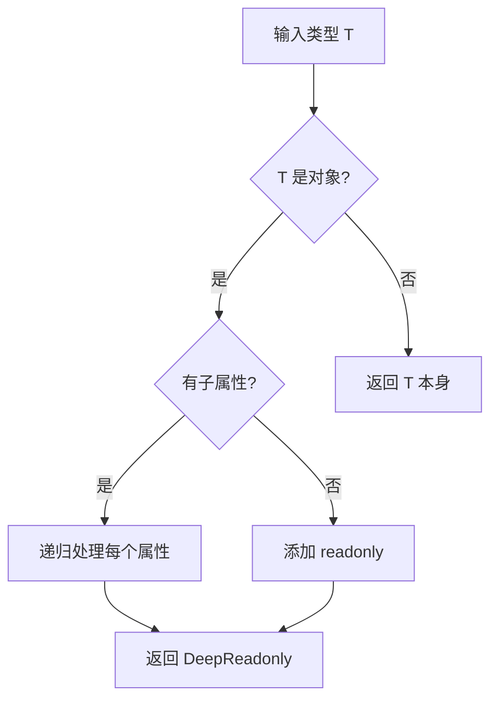

从 `Partial<T>` 到 `DeepReadonly<T>`，从条件类型到模板字面量类型。

本文带你一步步拆解那些看起来像天书一样的类型体操题目，理解背后的类型系统原理。

## 基础工具类型

TypeScript 内置了很多工具类型，它们是类型体操的基础：




```typescript
// Partial：所有属性变可选
type Partial<T> = {
  [P in keyof T]?: T[P];
};

// Required：所有属性变必填
type Required<T> = {
  [P in keyof T]-?: T[P];  // -? 移除可选标记
};

// 使用
interface User {
  name: string;
  age: number;
}

type PartialUser = Partial<User>;     // { name?: string; age?: number }
type RequiredUser = Required<User>;   // { name: string; age: number }
```



```typescript
// Pick：从 T 中挑选部分属性
type Pick<T, K extends keyof T> = {
  [P in K]: T[P];
};

// Omit：从 T 中排除部分属性
type Omit<T, K extends keyof any> = Pick<T, Exclude<keyof T, K>>;

// 使用
interface User {
  name: string;
  age: number;
  email: string;
}

type UserBasic = Pick<User, 'name' | 'age'>;  // { name: string; age: number }
type UserNoEmail = Omit<User, 'email'>;       // { name: string; age: number }
```



```typescript
// Record：构造键值对类型
type Record<K extends keyof any, T> = {
  [P in K]: T;
};

// ReturnType：获取函数返回值类型
type ReturnType<T extends (...args: any) => any>
  = T extends (...args: any) => infer R ? R : never;

// 使用
type UserMap = Record<string, User>;

function getUser() { return { name: 'Alice', age: 30 }; }
type User = ReturnType<typeof getUser>;  // { name: string; age: number }
```




## 条件类型与 infer

条件类型是类型体操的核心——**根据类型关系选择不同分支**：

```typescript
// 基本语法：T extends U ? X : Y
type IsString<T> = T extends string ? true : false;

type A = IsString<string>;   // true
type B = IsString<number>;   // false
```

### infer 关键字

`infer` 在条件类型中**推断并提取类型**：

```typescript
// 提取函数参数类型
type Parameters<T> = T extends (...args: infer P) => any ? P : never;

// 提取 Promise 的值类型
type Unpacked<T> = T extends Promise<infer U> ? U : T;

// 提取数组元素类型
type ElementOf<T> = T extends (infer E)[] ? E : never;

type R1 = Parameters<(a: string, b: number) => void>;  // [string, number]
type R2 = Unpacked<Promise<string>>;                    // string
type R3 = ElementOf<string[]>;                          // string
```


`infer` 的精髓在于：**声明一个类型变量，让 TS 自己推断它的值**。相当于类型层面的"模式匹配"。


## 经典体操题

### DeepReadonly

递归地把所有属性变为只读：


```typescript
type DeepReadonly<T> = {
  readonly [P in keyof T]: T[P] extends object
    ? T[P] extends Function
      ? T[P]          // 函数保持原样
      : DeepReadonly<T[P]>  // 递归
    : T[P];           // 基本类型直接 readonly
};

// 测试
interface Obj {
  a: string;
  b: { c: number; d: { e: boolean } };
  fn: () => void;
}

type ReadonlyObj = DeepReadonly<Obj>;
// {
//   readonly a: string;
//   readonly b: { readonly c: number; readonly d: { readonly e: boolean } };
//   readonly fn: () => void;
// }
```


### DeepPartial

递归地把所有属性变为可选：


```typescript
type DeepPartial<T> = {
  [P in keyof T]?: T[P] extends object
    ? DeepPartial<T[P]>
    : T[P];
};

// 使用
interface Config {
  server: { host: string; port: number };
  db: { name: string; user: string };
}

type PartialConfig = DeepPartial<Config>;
// {
//   server?: { host?: string; port?: number };
//   db?: { name?: string; user?: string };
// }
```


### TupleToUnion

把元组转成联合类型：


```typescript
type TupleToUnion<T extends readonly any[]> = T[number];

// 测试
type Tuple = [string, number, boolean];
type Union = TupleToUnion<Tuple>;  // string | number | boolean
```

**原理**：`T[number]` 获取元组所有元素的联合类型。索引访问类型 `[number]` 对数组/元组返回元素类型的联合。


## 模板字面量类型

TypeScript 4.1 引入了模板字面量类型，可以做**字符串层面的类型操作**：

```typescript
// 基本用法
type Greeting = `hello ${string}`;
const g: Greeting = 'hello world';  // ✅

// Uppercase / Lowercase
type Upper = Uppercase<'hello'>;  // 'HELLO'
type Lower = Lowercase<'WORLD'>;  // 'world'

// 实战：get 属性名转 set 方法名
type Getters<T> = {
  [K in keyof T as `get${Capitalize<string & K>}`]: () => T[K];
};

interface Person {
  name: string;
  age: number;
}

type PersonGetters = Getters<Person>;
// {
//   getName: () => string;
//   getAge: () => number;
// }
```

## 数学公式示例

类型体操中经常涉及递归和数学关系，用公式描述更直观：

行内公式：$T_n = T_{n-1} + T_{n-2}$（斐波那契递推）

块级公式：

$$
\text{DeepReadonly}(T) = \begin{cases}
\text{readonly} & \text{if } T \text{ is primitive} \\
\text{DeepReadonly}(T[P]) \text{ for each } P \in T & \text{if } T \text{ is object}
\end{cases}
$$

## Mermaid 流程图



## 总结


**类型体操学习路径**：
1. 熟练掌握 `Partial / Pick / Omit / Record` 等基础工具类型
2. 理解条件类型 `T extends U ? X : Y` 和 `infer` 的模式匹配
3. 学会递归类型（`DeepReadonly / DeepPartial`）
4. 掌握模板字面量类型做字符串操作
5. 多刷题，培养类型层面的思维


：[type-challenges](https://github.com/type-challenges/type-challenges) 是最佳练习平台


