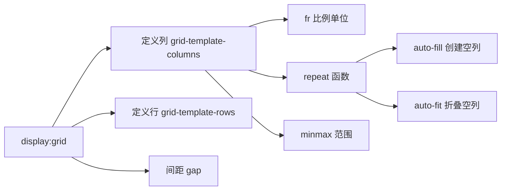

Grid 布局比 Flexbox 更适合二维布局。`grid-template-columns: repeat(auto-fill, minmax(260px, 1fr))` 这行代码能实现完美的自适应卡片墙。

## Grid vs Flexbox


**简单记法**：
- **Flexbox** 是**一维**布局——一次控制一行或一列
- **Grid** 是**二维**布局——同时控制行和列


| 特性 | Flexbox | Grid |
|------|---------|------|
| 维度 | 一维 | 二维 |
| 适用 | 导航栏、工具条 | 卡片墙、页面布局 |
| 对齐 | 主轴/交叉轴 | 行+列精确控制 |
| 间距 | gap | gap |

## 基础用法

### 定义网格

```css
.grid-container {
  display: grid;
  /* 3列等宽 */
  grid-template-columns: 1fr 1fr 1fr;
  /* 简写 */
  grid-template-columns: repeat(3, 1fr);
  /* 间距 */
  gap: 16px;
}
```

### fr 单位

`fr`（fraction）是比例单位，按剩余空间分配：

```css
/* 左侧固定 200px，右侧占满剩余 */
grid-template-columns: 200px 1fr;

/* 比例分配 */
grid-template-columns: 1fr 2fr 1fr;  /* 1:2:1 */
```

## 自适应卡片墙


**经典一行代码**：`grid-template-columns: repeat(auto-fill, minmax(260px, 1fr))`

- `auto-fill`：自动填充列数
- `minmax(260px, 1fr)`：每列最小 260px，最大均分剩余空间
- 窗口变大→自动增多列数；变小→自动减少列数


```css
.card-wall {
  display: grid;
  grid-template-columns: repeat(auto-fill, minmax(260px, 1fr));
  gap: 20px;
}

.card {
  background: #fff;
  border-radius: 12px;
  padding: 20px;
  box-shadow: 0 2px 8px rgba(0,0,0,0.06);
}
```




`auto-fill`：**创建空轨道**填满容器

```css
grid-template-columns: repeat(auto-fill, minmax(200px, 1fr));
```

当容器有多余空间但不足够放下一列时，会保留**空列**。卡片不会拉伸占满空间。

**适用**：希望卡片保持固定大小，不拉伸



`auto-fit`：**折叠空轨道**，已有卡片拉伸占满

```css
grid-template-columns: repeat(auto-fit, minmax(200px, 1fr));
```

当容器有多余空间时，空轨道会被折叠为 0，已有卡片**拉伸**占满剩余空间。

**适用**：希望卡片始终填满容器




## 网格定位

### grid-area 命名布局

```css
.page-layout {
  display: grid;
  grid-template-areas:
    "header header header"
    "sidebar main main"
    "footer footer footer";
  grid-template-rows: 60px 1fr 40px;
  grid-template-columns: 200px 1fr 1fr;
  gap: 12px;
  min-height: 100vh;
}

.header  { grid-area: header; }
.sidebar { grid-area: sidebar; }
.main    { grid-area: main; }
.footer  { grid-area: footer; }
```

```html
<div class="page-layout">
  <header class="header">Header</header>
  <nav class="sidebar">Sidebar</nav>
  <main class="main">Main Content</main>
  <footer class="footer">Footer</footer>
</div>
```

### grid-column / grid-row 跨越

```css
.featured {
  /* 从第1列到第3列（跨越2列） */
  grid-column: 1 / 3;
  /* 从第1行到第3行（跨越2行） */
  grid-row: 1 / 3;
}

/* 简写：span N */
.wide {
  grid-column: span 2;  /* 跨越2列 */
}
```

## 对齐方式


| 属性 | 作用对象 | 说明 |
|------|---------|------|
| `justify-items` | 单个格子内 | 水平对齐 |
| `align-items` | 单个格子内 | 垂直对齐 |
| `place-items` | 单个格子内 | 上面两个的简写 |
| `justify-content` | 整个网格 | 水平分布 |
| `align-content` | 整个网格 | 垂直分布 |
| `place-content` | 整个网格 | 上面两个的简写 |


## 响应式布局

不需要媒体查询，Grid 也能做响应式：

```css
/* 小屏1列，大屏自动多列 */
.responsive-grid {
  display: grid;
  grid-template-columns: repeat(auto-fit, minmax(min(100%, 280px), 1fr));
  gap: 16px;
}
```


`min(100%, 280px)` 是关键：在容器宽度小于 280px 时，取 100%（避免溢出）；否则取 280px。


## Mermaid 示意图



## 实战技巧


```css
/* 1. 居中布局 */
.center {
  display: grid;
  place-items: center;
}

/* 2. 经典圣杯布局 */
.holy-grail {
  display: grid;
  grid-template: auto 1fr auto / 200px 1fr 200px;
  grid-template-areas:
    "header header header"
    "nav main aside"
    "footer footer footer";
}

/* 3. 瀑布流模拟（列方向） */
.masonry {
  display: grid;
  grid-template-columns: repeat(auto-fill, minmax(200px, 1fr));
  grid-auto-rows: 10px;
  gap: 16px;
}
.masonry .item {
  /* 需要JS计算 row span */
  grid-row: span var(--rows);
}
```


## 总结


**Grid 核心要点**：
1. Grid 是二维布局，Flex 是一维布局
2. `repeat(auto-fill, minmax(260px, 1fr))` 实现自适应卡片墙
3. `grid-template-areas` 直观命名布局
4. `span N` 轻松跨越多行多列
5. 配合 `min()` / `max()` / `clamp()` 无需媒体查询也能响应式



