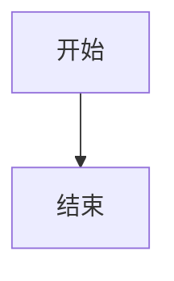
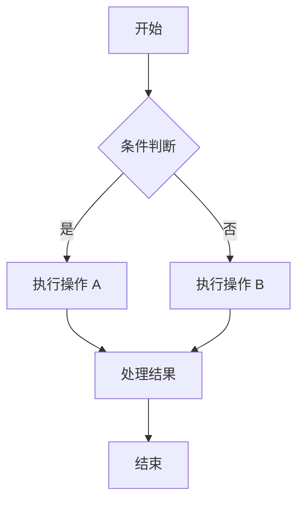
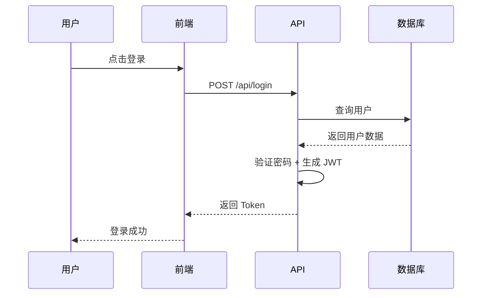
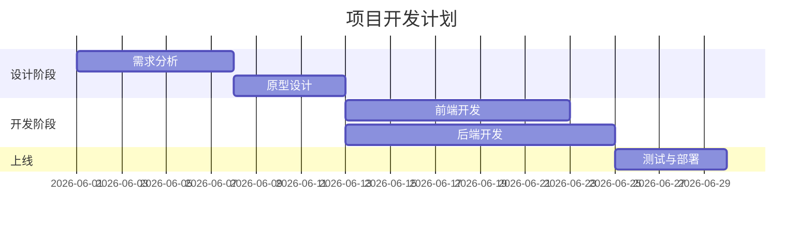

---
title: moeMac标签外挂演示
date: 2026-06-30 12:00:00
cover: https://picsum.photos/seed/moemac-tags/600/400
sticky: 1
tags:
  - 前端
  - 工具
categories:
  - 技术
---

本文是 moeMac 主题所有标签外挂（Tag Plugins）的**完整语法教程**与**效果演示**。所有功能开箱即用，无需额外安装插件。

> **提示**：每个功能都包含「语法」和「效果」两部分，你可以直接复制语法到自己的文章中使用。

<!-- more -->


## Note 提示容器

用于在文章中突出显示提示、警告等信息。支持多种类型和两种语法。

### 语法

**方式一：`:::` 容器语法（推荐）**

```markdown
::: tip
提示内容
:::

::: warning 自定义标题
带自定义标题的警告
:::
```

支持的类型：`tip` / `info` / `warning` / `danger` / `success` / `note` / `primary` / `default`

**方式二：`` 标签语法**

```markdown

内容

```

### 效果

::: tip
这是一个提示（tip）容器，用于展示一般性提示信息。
:::

::: info
这是一个信息（info）容器，用于展示补充信息。
:::

::: warning
这是一个警告（warning）容器，需要注意的事项。
:::

::: danger
这是一个危险（danger）容器，表示需要特别注意的操作。
:::

::: success
这是一个成功（success）容器，表示操作完成。
:::

::: warning 自定义标题
容器也可以自定义标题，就像这个一样。
:::


这是一个 primary 类型的 note 容器，使用标签语法。



note 容器内部也**支持 Markdown** 语法：

- 列表项一
- 列表项二
- 列表项三



## Checkbox 待办事项

用于展示待办列表，支持勾选状态和多种颜色。

### 语法

```markdown
                    未完成
        已完成
  指定颜色
```

支持的颜色：`red` / `green` / `blue` / `yellow` / `cyan` / `purple`

### 效果










## Tabs 标签页

将多个内容组织在不同的标签中，节省页面空间。

### 语法

```markdown



标签1内容



标签2内容



```

### 效果




这是第一个标签页的内容，默认显示。

支持 **Markdown** 格式，包括：

- 列表项 1
- 列表项 2
- 列表项 3



这是第二个标签页的内容，支持代码块：

```javascript
const greet = (name) => {
  console.log(`Hello, ${name}!`);
};

greet('moeMac');
```



这是第三个标签页的内容。

> 引用也可以用在 Tab 里。

| 功能 | 状态 |
|------|------|
| Tabs | ✅ |
| Note | ✅ |
| Mermaid | ✅ |





## Folding 折叠面板

默认收起，点击标题展开内容，适合放置较长的补充说明。

### 语法

```markdown

折叠内容

```

支持的颜色：`blue` / `green` / `red` / `yellow` / `orange` / `purple`（可选，不填为默认色）

### 效果


点击标题可以展开/收起内容。

这里可以放较长的内容，默认折叠节省页面空间。



蓝色边框的折叠面板，适合信息类内容。



绿色边框的折叠面板，适合成功/完成类内容。



红色边框的折叠面板，适合警告类内容。



## Hide 隐藏文本

用于隐藏敏感内容或剧透内容，支持行内隐藏和块级隐藏。

### 语法

```markdown
                        行内隐藏（鼠标悬停显示）
 隐藏块内容    块级隐藏
 可展开内容      可展开隐藏
```

### 效果

**行内隐藏：**

这是一个句子，其中  需要鼠标悬停才能看到。

**隐藏块：**


这里是隐藏的块级内容，点击按钮后才会显示。

可以包含任意 Markdown 内容：

```python
print("Hello, Hidden World!")
```


**可展开隐藏：**


类似折叠面板，但视觉风格不同。适合用于 FAQ 或答案展示。



## Badge 徽章

用于在行内突出显示状态标签，支持多种颜色和圆角样式。

### 语法

```markdown
           方形徽章
     圆角徽章
```

支持的颜色：`red` / `green` / `blue` / `yellow` / `orange` / `purple` / `gray` / `cyan`

### 效果

这是一个热门功能的演示。

   


## Label 行内标签

给文字添加彩色背景高亮，类似荧光笔效果。

### 语法

```markdown

```

支持的颜色：`red` / `blue` / `green` / `yellow` / `orange` / `purple` / `pink` / `gray`

### 效果

这是一段包含和的文本。

也支持、、、等颜色。


## Mark 文本高亮

用彩色背景标记文字，类似荧光笔标记，比 Label 更轻量。

### 语法

```markdown
               默认黄色
          指定颜色
```

支持的颜色：`yellow` / `red` / `green` / `blue` / `purple` / `cyan`

### 效果

这句话中被高亮了，也是。

还可以和。


## Button 按钮链接

创建美观的链接按钮，支持图标和居中。

### 语法

```markdown
              默认按钮
      居中按钮
        彩色按钮
```

图标使用 Font Awesome 名称，如 `fa-link` / `fa-star` / `fa-book` / `fa-code` 等。

支持的颜色：`red` / `green` / `blue` / `yellow` / `orange` / `purple` / `pink` / `cyan` / `gray`

### 效果

 

彩色按钮：

   

居中按钮：




## Btns 按钮组

将多个按钮排列成一组，支持圆角和居中。

### 语法

```markdown




```

可选参数：`rounded`（圆角按钮）、`center`（居中排列）
按钮颜色：`red` / `green` / `blue` / `yellow` / `orange` / `purple` / `pink` / `cyan` / `gray`

### 效果










## Quot 带作者引用

比普通引用更优雅，支持添加作者信息。

### 语法

```markdown


```

### 效果








## Flink 友链卡片

批量展示友情链接，以网格卡片排列，每个卡片包含头像、站点名称和描述。适合做友链页面或推荐站点列表。

### 语法

```markdown

- name: 站点名称
  link: https://example.com
  avatar: https://example.com/favicon.png
  desc: 站点描述
- name: 另一个站点
  link: https://another.com
  avatar: https://another.com/favicon.png
  desc: 另一个描述

```

### 效果


- name: Hexo
  link: https://hexo.io
  avatar: https://hexo.io/favicon.svg
  desc: 快速、简洁且高效的博客框架
- name: Butterfly
  link: https://butterfly.js.org
  avatar: https://butterfly.js.org/img/favicon.png
  desc: A Simple and Card UI Design theme
- name: Vue.js
  link: https://vuejs.org
  avatar: https://vuejs.org/logo.svg
  desc: 渐进式 JavaScript 框架
- name: Node.js
  link: https://nodejs.org
  avatar: https://nodejs.org/static/images/favicons/favicon.png
  desc: JavaScript 运行时



## Gallery 图片画廊

等高对齐画廊布局，每行图片根据原始宽高比自动计算高度，保持各行等高对齐。支持自定义列数和图片说明。

### 语法

```markdown




```

也支持逗号分隔格式：

```markdown

图片地址1, 说明1
图片地址2, 说明2

```

> 列数默认为 4，移动端自动降为 2~3 列。

### 效果







## Timeline 时间线

展示按时间排列的事件，适合做项目进度、更新日志等。

### 语法

```markdown



事件内容



另一个事件



```

### 效果




博客正式上线，使用 Hexo + moeMac 主题。



添加 Vue 3 组合式 API 文章。



添加 CSS Grid 布局实战笔记。



添加 Node.js API 服务教程。



完成标签外挂功能移植，支持 30+ 种标签外挂。





## Copy 行内复制

行内代码复制按钮，点击即可复制文本到剪贴板。

### 语法

```markdown

```

### 效果

使用  安装 Hexo CLI。

部署命令：

配置文件路径：


## inlineImg 行内图片

在行内插入图片，支持自定义宽高。

### 语法

```markdown

```

### 效果

在行内插入小图片：``（将地址替换为有效图片即可显示）。

> 由于演示文章没有本地图片资源，此处仅展示语法。实际使用时请替换为有效图片地址。


## 数学公式（KaTeX）

支持行内公式和块级公式，使用 KaTeX 渲染。

### 语法

```markdown
行内公式：$E = mc^2$

块级公式：
$$
\int_{-\infty}^{\infty} e^{-x^2} dx = \sqrt{\pi}
$$
```

### 效果

**行内公式：**

质能方程 $E = mc^2$ 是物理学最著名的公式。

欧拉公式 $e^{i\pi} + 1 = 0$ 被称为最美的数学公式。

勾股定理 $a^2 + b^2 = c^2$ 描述直角三角形三边关系。

**块级公式：**

$$
\int_{-\infty}^{\infty} e^{-x^2} dx = \sqrt{\pi}
$$

$$
\sum_{n=1}^{\infty} \frac{1}{n^2} = \frac{\pi^2}{6}
$$

$$
\frac{\partial f}{\partial x} = \lim_{\Delta x \to 0} \frac{f(x + \Delta x) - f(x)}{\Delta x}
$$


## Mermaid 图表

在 Markdown 中绘制流程图、时序图、甘特图等。

### 语法

使用 mermaid 代码块（即以 mermaid 为语言标记的代码块）即可：

````

````

### 效果

**流程图：**



**时序图：**



**甘特图：**




## Linkcard 链接卡片

单个外部链接卡片，带标题、描述和可选缩略图，适合在文章中引用外部网站或资源。与 Flink 不同，Linkcard 用于单个链接的精美展示，而非批量友链。

### 语法

```markdown

```

### 效果






## Postcard 文章引用卡片

在文章中引用站内其他文章，自动获取标题、摘要和封面图，点击通过 AJAX 无刷新跳转。

### 语法

```markdown
                        单卡片，自动获取文章信息
    手动指定标题和描述
     完全自定义
          多卡片横排
```

> 文章路径为 Hexo 生成的 URL 路径，如 `/2026/06/30/moeMac主题标签外挂演示/`。
> 不指定标题和描述时会自动从文章的 `title`、`excerpt` 和 `cover` 中获取。
> 使用 `|` 分隔多个路径可一行显示多个卡片。

### 效果

**单卡片：**



**多卡片横排：**




## Poem 诗词排版

居中展示诗词，带有标题和作者，适合文学类内容。

### 语法

```markdown

第一行
第二行
第三行

```

### 效果


床前明月光
疑是地上霜
举头望明月
低头思故乡



## Radio 单选按钮

类似 Checkbox，但使用圆形单选按钮样式。

### 语法

```markdown
                    未选中
        已选中
 指定颜色
```

### 效果








## Divider 分割线

带图标和文字的装饰性分割线，比普通 `<hr>` 更美观。

### 语法

```markdown
                        普通分割线
                带图标的分割线
      带图标和文字
```

### 效果








## Detail 详情展开

简洁的折叠面板，点击展开/收起内容。

### 语法

```markdown

详情内容

```

### 效果


这里是详情内容，点击标题可以收起。

支持 **Markdown** 语法和列表：

- 列表项一
- 列表项二



适合放置技术文档中的补充说明，默认折叠不占空间。



## Kbd 键盘按键

展示键盘按键样式，适合编写快捷键教程。

### 语法

```markdown
              单个按键
          组合键（自动拆分）
```

### 效果

按  +  复制， +  粘贴。

快捷键： 打开任务管理器。

按  确认， 取消。


## Span 自定义样式

给行内文字添加自定义样式，支持颜色和字体效果组合。

### 语法

```markdown



```

支持的颜色：`red` / `blue` / `green` / `purple` / `orange` / `pink` / `gray`
支持的样式：`bold` / `italic` / `underline` / `strike` / `large` / `small`

### 效果

这是一段包含和的句子。

支持组合样式：、、。

 也可以用 span 实现。


## Icon 行内图标

在文字中插入 Font Awesome 图标，支持指定颜色。

### 语法

```markdown
              默认图标
          红色图标
 绿色图标
```

### 效果

 爱心、 星星、 对勾、 信息。

在句子中使用：请注意 这个警告图标。


## U 下划线

给文字添加强调下划线，颜色跟随主题色。

### 语法

```markdown

```

### 效果

这句话中被加上了下划线，。


## Abbr 缩写提示

鼠标悬停时显示缩写的完整名称。

### 语法

```markdown


```

### 效果

网页由  结构和  样式组成。

前端开发常用 、 和 。


## Aside 旁注

将文字以旁注形式展示，适合补充说明或引用。

### 语法

```markdown


```

### 效果



正文内容继续，旁注会在左侧以特殊样式显示。




## Sub/Sup 上下标

插入上标和下标文字，适合化学公式、数学表达等。

### 语法

```markdown
HO              下标
E = mc          上标
```

### 效果

水分子：HO，二氧化碳：CO。

质能方程：E = mc，面积单位：m、体积单位：m。


## Bubble 气泡注释

鼠标悬停时显示注释气泡，适合在不打断阅读流的情况下补充说明。

### 语法

```markdown

```

### 效果

这是一个包含的句子。

也可以一下某个概念。


## Progress 进度条

可视化展示进度、完成度等数值信息。

### 语法

```markdown

```

支持的颜色：`red` / `green` / `blue` / `yellow` / `orange` / `purple` / `cyan` / `pink`

### 效果










## Steps 步骤条

将内容组织在可切换的步骤中，适合教程、流程说明等场景。

### 语法

```markdown



步骤一内容



步骤二内容



```

### 效果




安装 Node.js 和 Hexo CLI：

```bash
npm install -g hexo-cli
```



创建新的 Hexo 博客：

```bash
hexo init my-blog
cd my-blog
npm install
```



将 moeMac 主题放入 `themes/moeMac` 目录，然后在 `_config.yml` 中设置：

```yaml
theme: moeMac
```




```bash
hexo server
```

访问 `http://localhost:4000` 即可看到效果。





## Carousel 轮播图

图片轮播组件，支持自动播放、手动切换和触摸滑动。

### 语法

```markdown




```

### 效果







## Card 卡片容器

带标题和颜色的卡片容器，适合突出展示重要内容。

### 语法

```markdown

卡片内容

```

支持的颜色：`red` / `green` / `blue` / `yellow` / `orange` / `purple` / `cyan` / `pink` / `default`

### 效果


这是一个蓝色卡片容器，内部**支持 Markdown** 语法。

- 列表项一
- 列表项二

> 也可以使用引用块。



使用 moeMac 主题搭建博客的步骤简单明了，几分钟即可完成部署。



请确保 Node.js 版本 >= 14，否则部分功能可能无法正常使用。



## 功能总结

moeMac 主题已支持以下 **38 种** 标签外挂功能：

| 功能 | 语法 | 说明 |
|------|------|------|
| Note 容器 | `::: type` | 提示/警告/危险等容器块 |
| Checkbox 待办 | `checkbox` | 待办事项列表 |
| Radio 单选 | `radio` | 单选按钮 |
| Tabs 标签页 | `tabs` | 标签页切换 |
| Folding 折叠 | `folding` | 可展开/收起的面板 |
| Detail 详情 | `detail` | 简洁折叠面板 |
| Hide 隐藏 | `hide` | 鼠标悬停显示 |
| HideBlock | `hideBlock` | 点击显示块 |
| HideToggle | `hideToggle` | 可展开隐藏 |
| Badge 徽章 | `badge` | 行内彩色徽章 |
| Label 标签 | `label` | 行内彩色文字 |
| Mark 高亮 | `mark` | 荧光笔标记 |
| Button 按钮 | `btn` | 按钮链接 |
| Btns 按钮组 | `btns` | 多按钮排列 |
| Linkcard 链接卡片 | `linkcard` | 卡片式链接 |
| Postcard 文章卡片 | `postcard` | 站内文章引用卡片 |
| Quot 引用 | `quot` | 带作者引用 |
| Poem 诗词 | `poem` | 诗词排版 |
| Flink 友链 | `flink` | 友情链接卡片 |
| Gallery 画廊 | `gallery` | 图片网格画廊 |
| Timeline 时间线 | `timeline` | 时间轴 |
| Copy 复制 | `copy` | 行内代码复制 |
| Divider 分割线 | `divider` | 装饰性分割线 |
| Kbd 键盘按键 | `kbd` | 键盘按键样式 |
| Span 样式 | `span` | 自定义行内样式 |
| Icon 图标 | `icon` | 行内 Font Awesome 图标 |
| U 下划线 | `u` | 强调下划线 |
| Abbr 缩写 | `abbr` | 悬停提示缩写 |
| Aside 旁注 | `aside` | 旁注引用 |
| Sub 下标 | `sub` | 下标文字 |
| Sup 上标 | `sup` | 上标文字 |
| Bubble 气泡注释 | `bubble` | 悬停显示注释气泡 |
| Progress 进度条 | `progress` | 可视化进度条 |
| Steps 步骤条 | `steps` | 可切换步骤内容 |
| Carousel 轮播图 | `carousel` | 图片轮播组件 |
| Card 卡片容器 | `card` | 带标题颜色卡片 |
| 数学公式 | `$...$` | KaTeX 渲染 |
| Mermaid 图表 | `mermaid` | 流程图/时序图/甘特图 |
