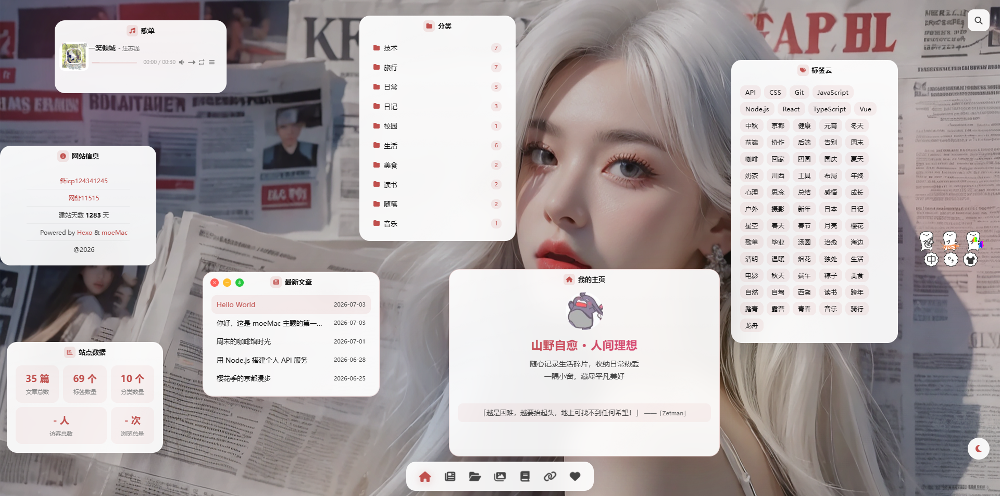
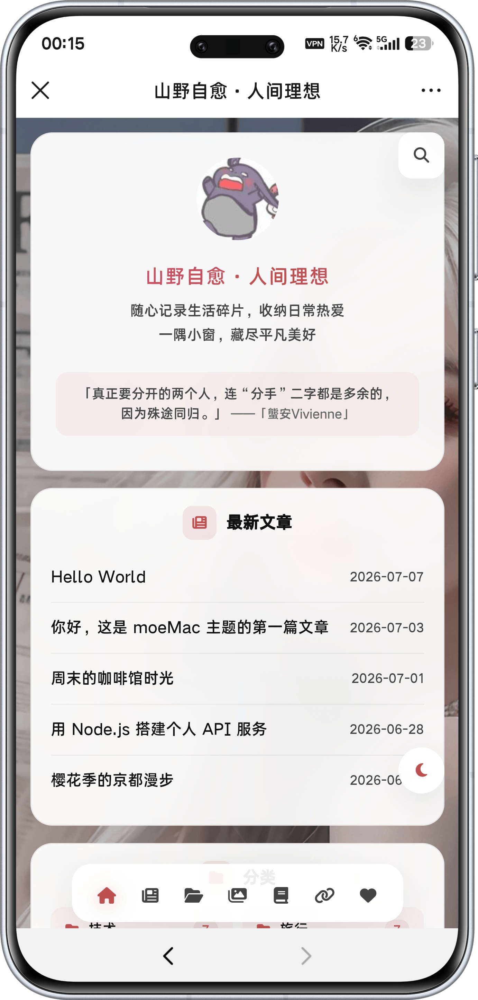

<div align="center">

# moeMac

一个仿 macOS 桌面体验的 Hexo 主题

Dock 导航 · 浮动窗口 · 毛玻璃质感 · 暗黑模式

[](https://hexo.io)
[](./LICENSE)
[](https://nodejs.org)

**[在线演示](https://s-ruthless.github.io) · [文档](#安装) · [配置](#配置说明) · [常见问题](#常见问题)**

</div>

---

## 简介

moeMac 是一个 Hexo 主题，将你的博客变成一个 macOS 桌面：Dock 导航栏、可拖拽的浮动窗口、红绿灯按钮、毛玻璃质感。支持暗黑模式、音乐播放器、AJAX 无刷新导航、移动端适配。

<div align="center">

| 桌面端 | 移动端 |
|---|---|
|  |  |

</div>

## 特性

| 特性 | 说明 |
|---|---|
| 🖥️ macOS 桌面体验 | Dock 导航栏、可拖拽浮动窗口、红绿灯按钮、窗口置顶/最小化 |
| 🌙 暗黑模式 | 一键切换，全站适配（含代码高亮、评论区自动同步） |
| 🎵 音乐播放器 | APlayer + Meting，支持网易云 / QQ 音乐 / 酷狗等平台歌单 |
| 💬 多评论系统 | Giscus / Waline / Twikoo / Gitalk，暗黑模式自动切换 |
| 🔍 站内搜索 | hexo-generator-searchdb，即时搜索弹窗 |
| 📊 归档统计 | 年度文章数量柱状图 + SVG 折线图 + 年份折叠 |
| 🖼️ 相册页面 | 瀑布流布局 + 灯箱查看 |
| 📚 豆瓣书影音 | 内置抓取脚本，无需安装额外插件 |
| ⚡ AJAX 导航 | 无刷新页面切换 + 过渡动画 |
| 📱 响应式适配 | 移动端独立布局，玻璃卡片流 |
| 🎨 主题色自定义 | 一行配置换全站强调色 |
| 🖼️ 壁纸设置 | 自定义背景图片 + 暗黑模式自动遮罩 |
| ✨ GSAP 动画 | 窗口入场、滚动触发、悬停微交互 |
| 💡 一言 / 每日一句 | Hitokoto API 或本地句子库 |

## 安装

### 1. 克隆主题

```bash
cd your-hexo-blog
git clone https://github.com/s-Ruthless/s-Ruthless.github.io.git themes/moeMac
```

### 2. 安装依赖

主题仅依赖 Hexo 标准插件（`hexo init` 自带），无需额外安装。

如果需要站内搜索功能，安装一个插件即可：

```bash
npm install hexo-generator-searchdb
```

> 不需要搜索功能可跳过，在主题 `_config.yml` 中设置 `search: false`。

#### 无需额外插件的功能

| 功能 | 实现方式 |
|---|---|
| 豆瓣书影音 | 主题自带 `scripts/douban-sync.js`，使用 Node.js 内置模块 |
| 音乐播放器 | 前端 JS 动态加载 APlayer + Meting |
| 评论系统 | Giscus / Waline / Twikoo 均为前端加载 |
| 暗黑模式 | CSS + localStorage |
| AJAX 导航 | 前端 JS |

### 3. 启用主题

编辑**站点根目录** `_config.yml`：

```yaml
theme: moeMac
```

### 4. 配置搜索

安装 `hexo-generator-searchdb` 插件后，在主题 `themes/moeMac/_config.yml` 中开启搜索：

```yaml
search: true   # true 显示搜索按钮，false 隐藏
```

### 5. 创建必要页面

```bash
hexo new page posts     # 文章列表页
hexo new page gallery   # 相册
hexo new page about     # 关于
hexo new page links     # 友链
hexo new page douban    # 豆瓣书影音
```

编辑各页面的 `index.md`，设置对应的 `layout`：

```yaml
# source/posts/index.md
---
title: 文章
layout: posts-wall
---

# source/gallery/index.md
---
title: 相册
layout: gallery
---

# source/about/index.md
---
title: 关于
layout: page-about
comment: true
---

# source/links/index.md
---
title: 友链
layout: page-links
comment: true
---

# source/douban/index.md
---
title: 豆瓣
layout: page-douban
---
```

## 配置说明

编辑 `themes/moeMac/_config.yml`，以下为核心配置项。

### 基本信息

```yaml
blog_name: "你的博客名"
blog_description: "博客描述"
author: "你的名字"
```

### 头像

```yaml
# 方式一：文字头像
avatar_type: "text"
avatar_text: "我"

# 方式二：图片头像
avatar_type: "image"
avatar_url: "https://example.com/avatar.png"
```

### 主题色

```yaml
accent_color: "#c0504d"  # 改成你喜欢的颜色，全站强调色同步切换
```

### Dock 导航栏

```yaml
dock:
  - { icon: "fas fa-house", label: "首页", page: "/", type: "page" }
  - { icon: "fas fa-newspaper", label: "文章", page: "/posts/", type: "page" }
  - { icon: "fas fa-folder-open", label: "归档", page: "/archives/", type: "page" }
  - { icon: "fas fa-images", label: "相册", page: "/gallery/", type: "page" }
  - { icon: "fas fa-link", label: "友链", page: "/links/", type: "page" }
  - { icon: "fas fa-heart", label: "关于", page: "/about/", type: "page" }
  # type: page 站内页面 / link 外部链接
```

### 首页窗口

```yaml
home_windows:
  - "posts"       # 最新文章
  - "categories"  # 分类
  - "tags"        # 标签云
  - "music"       # 音乐播放器
  - "data"        # 站点数据
  - "info"        # 网站信息
recent_posts_count: 5
```

### 壁纸

```yaml
wallpaper_path: ""  # 留空使用默认渐变，或填图片 URL
```

### 音乐（可选）

```yaml
meting_api: "https://api.injahow.cn/meting/"  # 公共 API，建议自建
platform: "netease"      # netease / tencent / kugou / xiami / baidu
playlist_id: "你的歌单ID"  # 留空则不显示音乐窗口
show_desktop_lyrics: true # 桌面歌词
```

### 评论系统（可选）

支持 Giscus / Waline / Twikoo / Gitalk，选择一种配置即可。

#### Giscus（推荐）

1. 前往 [giscus.app](https://giscus.app) 获取配置
2. 填写：

```yaml
comments:
  enable: true
  provider: "giscus"
  giscus:
    repo: "yourname/your-repo"
    repoId: "R_xxxxx"
    category: "Announcements"
    categoryId: "DIC_xxxxx"
    mapping: "pathname"
    inputPosition: "top"
    reactionsEnabled: 0
```

> 主题会根据站点暗黑模式自动切换 Giscus 主题，无需手动配置。

#### Waline

```yaml
comments:
  enable: true
  provider: "waline"
  waline:
    serverURL: "https://your-waline.vercel.app"
```

#### Twikoo

```yaml
comments:
  enable: true
  provider: "twikoo"
  twikoo:
    envId: "你的环境ID"
```

### 一言 / 每日一句

```yaml
hitokoto: true                    # true 使用一言 API，false 使用本地句子
hitokoto_api: "https://v1.hitokoto.cn/"
sentences:                        # hitokoto 为 false 或 API 失败时使用
  - "生活明朗，万物可爱。"
  - "愿你眼中有光，心中有爱。"
```

### 网站信息

```yaml
site_info:
  icp: ""           # ICP 备案号，留空不显示
  psbc: ""          # 公安备案号，留空不显示
  start_date: "2023-01-01"  # 建站日期，用于计算建站天数
  copyright: "@2026"
```

### 静态资源 CDN

所有静态资源默认使用本地 `/assets/` 路径。如需使用 CDN：

```yaml
# 留空 = 使用本地路径
# 填写后所有资源自动走 CDN（末尾不加 /）
cdn: "https://your-cdn.com/moemac/assets"
```

## 相册使用

编辑 `source/gallery/index.md`，使用 Markdown 图片语法：

```markdown

large: 大图URL（可选，不写则用缩略图）
```

## 豆瓣书影音

### 方式一：自动抓取（推荐）

主题自带豆瓣抓取脚本（`scripts/douban-sync.js`），使用 Node.js 原生模块，无需安装任何额外 npm 包。

```yaml
douban:
  user_id: "你的豆瓣ID"       # douban.com/people/xxx/ 中的 xxx
  auto_sync: false            # true 开启自动同步
  sync_interval_hours: 24     # 自动同步间隔（小时）
  cookie: ""                  # 可选，登录后的 cookie
```

**手动同步**（随时运行）：

```bash
npx hexo douban              # 抓取全部（书 + 影 + 音）
npx hexo douban --books      # 只抓书
npx hexo douban --movies     # 只抓电影
npx hexo douban --music      # 只抓音乐
```

**自动同步**（`auto_sync: true` 时生效）：

开启后，每次 `hexo generate` / `hexo server` 会自动检查上次同步时间，距上次同步超过 `sync_interval_hours` 才触发，不会每次 build 都等待。

脚本会自动抓取豆瓣收藏并下载封面图到 `source/images/douban/`，数据保存到 `source/_data/douban.json`。

### 方式二：手动配置

```yaml
douban:
  books:
    - { name: "书名", cover: "封面URL", rating: 9, date: "2026-01-01", note: "读后感" }
  movies:
    - { name: "电影名", cover: "海报URL", rating: 8, date: "2026-01-01", note: "观后感" }
  music:
    - { name: "专辑名", cover: "封面URL", rating: 8, date: "2026-01-01", note: "听后感" }
```

> rating 为 10 分制，自动换算成 5 星显示。两种方式可共存：有 douban.json 时优先用抓取数据，没有则回退到手动配置。

## 文章配置

### 文章页选项

在主题 `_config.yml` 中：

```yaml
post:
  show_toc: true       # 显示文章目录
  show_date: true      # 显示发布日期
  copyright: true      # 显示版权声明（单篇文章可写 copyright: false 关闭）
```

### 文章 Front-matter

```yaml
---
title: 文章标题
date: 2026-01-01
categories:
  - 技术
tags:
  - JavaScript
  - 前端
cover: https://example.com/cover.jpg  # 封面图（可选，用于社交分享）
excerpt: 文章摘要                      # 摘要（可选）
---
```

## 目录结构

```
themes/moeMac/
├── _config.yml              # 主题配置
├── package.json
├── LICENSE                  # MIT 协议
├── README.md
├── layout/                  # EJS 模板
│   ├── layout.ejs           # 基础布局
│   ├── index.ejs            # 首页（浮动窗口桌面）
│   ├── post.ejs             # 文章详情
│   ├── post-list.ejs        # 文章列表
│   ├── posts-wall.ejs       # 文章墙
│   ├── archive.ejs          # 归档
│   ├── category.ejs         # 分类
│   ├── tag.ejs              # 标签
│   ├── page.ejs             # 通用页面
│   ├── page-about.ejs       # 关于页
│   ├── page-links.ejs       # 友链页
│   ├── page-douban.ejs      # 豆瓣页
│   ├── page-404.ejs         # 404 页
│   ├── gallery.ejs          # 相册页
│   └── _partial/            # 局部模板
│       ├── head.ejs         # <head> 区域
│       ├── scripts.ejs      # JS 引入
│       ├── dock.ejs         # Dock 导航栏
│       ├── search.ejs       # 搜索弹窗
│       ├── comments.ejs     # 评论系统
│       ├── global-music.ejs # 音乐播放器
│       ├── wallpaper-config.ejs  # 壁纸配置
│       ├── progress-bar.ejs # 进度条
│       ├── window-posts.ejs      # 文章窗口
│       ├── window-categories.ejs # 分类窗口
│       ├── window-tags.ejs       # 标签窗口
│       ├── window-data.ejs       # 数据窗口
│       └── window-info.ejs       # 信息窗口
├── scripts/
│   └── douban-sync.js       # 豆瓣抓取脚本
└── source/
    └── assets/
        ├── css/             # 所有样式
        │   ├── style.css    # 全局样式 + 暗黑模式
        │   ├── home.css     # 首页窗口样式
        │   ├── article.css  # 文章页样式 + 代码高亮
        │   ├── archive.css  # 归档页样式
        │   ├── pages.css    # 其他页面样式
        │   ├── mobile.css   # 移动端样式
        │   ├── aplayer.css  # 音乐播放器样式
        │   ├── gallery.css  # 相册样式
        │   ├── icons.css    # 图标样式
        │   ├── components.css # 轻量组件库（badge/btn/divider）
        │   ├── APlayer.min.css
        │   ├── gitalk.css
        │   └── waline.css
        ├── js/              # 所有脚本
        │   ├── main.js      # 主脚本
        │   ├── ui-enhance.js       # UI 增强
        │   ├── gsap-animations.js  # GSAP 动画
        │   ├── gsap.min.js
        │   ├── ScrollTrigger.min.js
        │   ├── APlayer.min.js
        │   ├── Meting.min.js
        │   ├── busuanzi.pure.mini.js
        │   ├── gitalk.min.js
        │   └── waline.js
        └── fonts/
            └── fa-solid-900.woff2  # Font Awesome 图标字体
```

## 技术栈

- **Hexo** + EJS 模板引擎
- **CSS** — 原生 CSS + CSS 变量，无构建步骤
- **DaisyUI** — 组件样式（本地化，不依赖 CDN）
- **GSAP** — 入场动画 + 滚动触发
- **APlayer + Meting** — 音乐播放器
- **Font Awesome** — 图标
- **Giscus / Waline / Twikoo / Gitalk** — 评论系统

## 常见问题

### CSS/JS 修改后不生效？

主题 CSS/JS 文件带有版本号参数（`?v=xxx`），修改后在以下文件中递增版本号：

- `themes/moeMac/layout/_partial/head.ejs` — CSS 版本号
- `themes/moeMac/layout/_partial/scripts.ejs` — JS 版本号

### 音乐播放器不显示？

1. 确认 `playlist_id` 已填写
2. 确认 `meting_api` 可访问（公共 API 可能限流，建议自建）
3. 确认 `home_windows` 中包含 `"music"`

### 评论区显示"配置不完整"？

检查 `themes/moeMac/_config.yml` 中 `comments` 部分，确保 `enable: true` 且对应 provider 的字段已填写。

### 移动端不显示返回顶部按钮？

移动端默认显示返回顶部按钮，如果看不到可能是页面内容不够长。按钮在滚动一定距离后才会出现。

## 浏览器兼容

- Chrome / Edge 88+
- Firefox 87+
- Safari 14+
- 移动端 Safari / Chrome

> 需要 `backdrop-filter` 和 `color-mix()` CSS 特性支持。

## 贡献

欢迎提交 Issue 和 Pull Request。

1. Fork 本仓库
2. 创建你的分支（`git checkout -b feature/amazing-feature`）
3. 提交更改（`git commit -m 'Add amazing feature'`）
4. 推送到分支（`git push origin feature/amazing-feature`）
5. 提交 Pull Request

## 开源协议

[MIT License](./LICENSE) © 2026 [屿](https://github.com/s-Ruthless)

## 致谢

- [Hexo](https://hexo.io) — 静态博客框架
- [DaisyUI](https://daisyui.com) — Tailwind CSS 组件库
- [APlayer](https://aplayer.js.org) + [MetingJS](https://github.com/metowolf/MetingJS) — 音乐播放器
- [GSAP](https://gsap.com) — 动画引擎
- [Font Awesome](https://fontawesome.com) — 图标库
- [Giscus](https://giscus.app) — GitHub Discussions 评论系统
